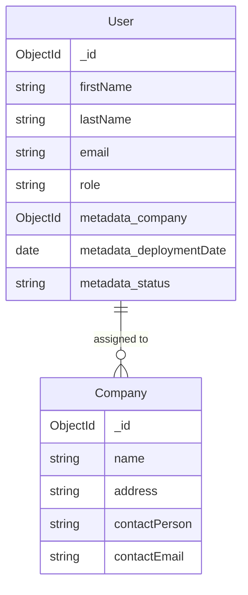

# Data Models Documentation

## Overview

This document provides comprehensive information about the data models used in the OJT Monitoring System API. Each model represents a core entity in the system with specific schemas, relationships, and constraints.

## Table of Contents

1. [User Model](#user-model)
2. [Company Model](#company-model)
3. [Model Relationships](#model-relationships)
4. [Database Indexes](#database-indexes)
5. [Data Validation](#data-validation)
6. [Model Usage Examples](#model-usage-examples)

## User Model

### Schema Definition

```typescript
interface UserModel extends Document {
  firstName: string; // Required
  lastName: string; // Required
  middleName?: string; // Optional
  email: string; // Required, unique
  password: string; // Required
  avatar?: string; // Optional, Cloudinary URL
  program?: "bsit" | "bsba"; // Optional, academic program
  role: "admin" | "coordinator" | "student"; // Required, default: "student"
  metadata?: {
    // Optional assignment metadata
    company?: Schema.Types.ObjectId; // Reference to Company
    deploymentDate?: Date; // OJT start date
    status?: "scheduled" | "deployed" | "completed"; // Deployment status
  };
}
```

### Database Schema

```javascript
const UserSchema = new Schema(
  {
    firstName: {
      type: String,
      required: true,
      trim: true,
      maxlength: 50,
    },
    lastName: {
      type: String,
      required: true,
      trim: true,
      maxlength: 50,
    },
    middleName: {
      type: String,
      trim: true,
      maxlength: 50,
    },
    email: {
      type: String,
      required: true,
      unique: true,
      lowercase: true,
      validate: {
        validator: (email) => /^[^\s@]+@[^\s@]+\.[^\s@]+$/.test(email),
        message: "Invalid email format",
      },
    },
    password: {
      type: String,
      required: true,
      minlength: 6,
    },
    program: {
      type: String,
      enum: ["bsit", "bsba"],
      lowercase: true,
    },
    avatar: {
      type: String,
      default: null,
      validate: {
        validator: (url) => !url || /^https?:\/\//.test(url),
        message: "Avatar must be a valid URL",
      },
    },
    role: {
      type: String,
      enum: ["admin", "coordinator", "student"],
      default: "student",
      required: true,
      lowercase: true,
    },
    metadata: {
      company: {
        type: mongoose.Schema.Types.ObjectId,
        ref: "Company",
        validate: {
          validator: function (v) {
            return this.role === "student" || !v;
          },
          message: "Only students can have company assignments",
        },
      },
      deploymentDate: {
        type: Date,
        validate: {
          validator: function (v) {
            return !v || v >= new Date("2020-01-01");
          },
          message: "Deployment date must be a valid date",
        },
      },
      status: {
        type: String,
        enum: ["scheduled", "deployed", "completed"],
        default: "scheduled",
        validate: {
          validator: function (v) {
            return this.role === "student" || v === "scheduled";
          },
          message: "Only students can have deployment status",
        },
      },
    },
  },
  {
    timestamps: true,
    collection: "users",
  }
);
```

### Field Descriptions

| Field                     | Type     | Required | Description                                   |
| ------------------------- | -------- | -------- | --------------------------------------------- |
| `firstName`               | String   | Yes      | User's first name (max 50 characters)         |
| `lastName`                | String   | Yes      | User's last name (max 50 characters)          |
| `middleName`              | String   | No       | User's middle name (max 50 characters)        |
| `email`                   | String   | Yes      | Unique email address, validated format        |
| `password`                | String   | Yes      | Hashed password (min 6 characters)            |
| `avatar`                  | String   | No       | Profile picture URL (Cloudinary)              |
| `program`                 | String   | No       | Academic program: "bsit" or "bsba"            |
| `role`                    | String   | Yes      | User role: "admin", "coordinator", "student"  |
| `metadata.company`        | ObjectId | No       | Reference to assigned company (students only) |
| `metadata.deploymentDate` | Date     | No       | OJT start date                                |
| `metadata.status`         | String   | No       | Deployment status (students only)             |

### Validation Rules

1. **Email Uniqueness**: No two users can have the same email
2. **Role-Based Metadata**: Only students can have company assignments
3. **Program Validation**: Must be either "bsit" or "bsba" if provided
4. **Password Security**: Minimum 6 characters (should be hashed)
5. **Date Validation**: Deployment dates must be reasonable

### Indexes

```javascript
UserSchema.index({ email: 1 }, { unique: true });
UserSchema.index({ role: 1 });
UserSchema.index({ "metadata.company": 1 });
UserSchema.index({ "metadata.status": 1 });
UserSchema.index({ createdAt: -1 });
```

## Company Model

### Schema Definition

```typescript
interface CompanyModel extends Document {
  name: string; // Required, company name
  address: string; // Required, physical address
  description?: string; // Optional, company description
  contactPerson: string; // Required, unique contact person
  contactEmail: string; // Required, contact email
  contactPhone?: string; // Optional, contact phone
}
```

### Database Schema

```javascript
const CompanySchema = new Schema(
  {
    name: {
      type: String,
      required: true,
      trim: true,
      maxlength: 100,
      validate: {
        validator: (name) => name.length >= 2,
        message: "Company name must be at least 2 characters",
      },
    },
    address: {
      type: String,
      required: true,
      trim: true,
      maxlength: 200,
    },
    description: {
      type: String,
      trim: true,
      maxlength: 500,
    },
    contactPerson: {
      type: String,
      required: true,
      unique: true,
      trim: true,
      maxlength: 100,
    },
    contactEmail: {
      type: String,
      required: true,
      lowercase: true,
      validate: {
        validator: (email) => /^[^\s@]+@[^\s@]+\.[^\s@]+$/.test(email),
        message: "Invalid email format",
      },
    },
    contactPhone: {
      type: String,
      trim: true,
      validate: {
        validator: function (phone) {
          return !phone || /^[\+]?[\d\s\-\(\)]{7,15}$/.test(phone);
        },
        message: "Invalid phone number format",
      },
    },
  },
  {
    timestamps: true,
    collection: "companies",
  }
);
```

### Field Descriptions

| Field           | Type   | Required | Description                                         |
| --------------- | ------ | -------- | --------------------------------------------------- |
| `name`          | String | Yes      | Company name (2-100 characters)                     |
| `address`       | String | Yes      | Physical address (max 200 characters)               |
| `description`   | String | No       | Company description (max 500 characters)            |
| `contactPerson` | String | Yes      | Primary contact person (unique, max 100 characters) |
| `contactEmail`  | String | Yes      | Contact email address                               |
| `contactPhone`  | String | No       | Contact phone number (validated format)             |

### Validation Rules

1. **Contact Person Uniqueness**: Each contact person can only represent one company
2. **Email Format**: Must be valid email format
3. **Phone Format**: Optional but must be valid international format if provided
4. **Name Length**: Company name must be at least 2 characters
5. **Address Required**: Physical address is mandatory for all companies

### Indexes

```javascript
CompanySchema.index({ contactPerson: 1 }, { unique: true });
CompanySchema.index({ name: 1 });
CompanySchema.index({ contactEmail: 1 });
CompanySchema.index({ createdAt: -1 });
```

## Model Relationships

### User-Company Relationship



### Relationship Types

1. **One-to-Many**: One company can have multiple students assigned
2. **Optional**: Students are not required to have company assignments
3. **Referential**: Company field in user metadata references Company collection
4. **Role-Restricted**: Only student users can have company assignments

### Population Example

```javascript
// Populate company information when fetching users
const usersWithCompanies = await User.find({ role: "student" })
  .populate('metadata.company', 'name address contactPerson contactEmail')
  .exec();

// Result includes full company details
{
  "_id": "...",
  "firstName": "John",
  "lastName": "Doe",
  "metadata": {
    "company": {
      "_id": "...",
      "name": "Tech Solutions Inc.",
      "address": "123 Business District",
      "contactPerson": "Jane Smith",
      "contactEmail": "jane@techsolutions.com"
    },
    "deploymentDate": "2025-11-01T00:00:00.000Z",
    "status": "deployed"
  }
}
```

## Database Indexes

### Performance Indexes

```javascript
// User collection indexes
db.users.createIndex({ email: 1 }, { unique: true });
db.users.createIndex({ role: 1 });
db.users.createIndex({ "metadata.company": 1 });
db.users.createIndex({ "metadata.status": 1 });
db.users.createIndex({ createdAt: -1 });

// Company collection indexes
db.companies.createIndex({ contactPerson: 1 }, { unique: true });
db.companies.createIndex({ name: 1 });
db.companies.createIndex({ contactEmail: 1 });
db.companies.createIndex({ createdAt: -1 });

// Compound indexes for common queries
db.users.createIndex({ role: 1, "metadata.status": 1 });
db.users.createIndex({ "metadata.company": 1, "metadata.status": 1 });
```

### Index Usage Patterns

1. **User Lookup**: Email index for authentication
2. **Role Filtering**: Role index for user lists
3. **Assignment Queries**: Company and status indexes for assignments
4. **Company Search**: Name and contact indexes for company lookup
5. **Temporal Queries**: Creation date indexes for reporting

## Data Validation

### Mongoose Middleware

```javascript
// Pre-save middleware for User model
UserSchema.pre("save", async function (next) {
  // Hash password if modified
  if (this.isModified("password")) {
    this.password = await bcrypt.hash(this.password, 12);
  }

  // Validate role-specific rules
  if (this.role !== "student" && this.metadata?.company) {
    throw new Error("Only students can be assigned to companies");
  }

  next();
});

// Pre-save middleware for Company model
CompanySchema.pre("save", function (next) {
  // Ensure contact person uniqueness
  if (this.isModified("contactPerson")) {
    // Additional validation logic
  }

  next();
});
```

### Custom Validators

```javascript
// Email format validator
const emailValidator = {
  validator: (email) => /^[^\s@]+@[^\s@]+\.[^\s@]+$/.test(email),
  message: "Invalid email format",
};

// Phone number validator
const phoneValidator = {
  validator: (phone) => !phone || /^[\+]?[\d\s\-\(\)]{7,15}$/.test(phone),
  message: "Invalid phone number format",
};

// Role-based company assignment validator
const companyAssignmentValidator = {
  validator: function (company) {
    return this.role === "student" || !company;
  },
  message: "Only students can have company assignments",
};
```

## Model Usage Examples

### Creating Users

```javascript
// Create a student user
const student = new User({
  firstName: "Alice",
  lastName: "Johnson",
  email: "alice.johnson@student.edu",
  password: "securepassword123",
  role: "student",
  program: "bsit",
});

await student.save();

// Create an admin user
const admin = new User({
  firstName: "Bob",
  lastName: "Administrator",
  email: "bob.admin@university.edu",
  password: "adminpassword456",
  role: "admin",
});

await admin.save();
```

### Creating Companies

```javascript
// Create a partner company
const company = new Company({
  name: "Digital Innovations Corp",
  address: "456 Tech Hub, Makati City",
  description: "Leading software development company",
  contactPerson: "Sarah Wilson",
  contactEmail: "sarah@digitalinnovations.com",
  contactPhone: "+63912345678",
});

await company.save();
```

### Assigning Students to Companies

```javascript
// Find student and company
const student = await User.findById("studentId");
const company = await Company.findById("companyId");

// Update student with company assignment
student.metadata = {
  company: company._id,
  deploymentDate: new Date("2025-11-15"),
  status: "scheduled",
};

await student.save();
```

### Complex Queries

```javascript
// Find all deployed students with company information
const deployedStudents = await User.find({
  role: "student",
  "metadata.status": "deployed",
}).populate("metadata.company", "name address contactPerson");

// Find companies with student count
const companiesWithStudents = await Company.aggregate([
  {
    $lookup: {
      from: "users",
      localField: "_id",
      foreignField: "metadata.company",
      as: "assignedStudents",
    },
  },
  {
    $project: {
      name: 1,
      address: 1,
      contactPerson: 1,
      studentCount: { $size: "$assignedStudents" },
    },
  },
]);

// Find students by deployment status distribution
const statusDistribution = await User.aggregate([
  { $match: { role: "student" } },
  { $group: { _id: "$metadata.status", count: { $sum: 1 } } },
  { $sort: { _id: 1 } },
]);
```

### Data Migration Scripts

```javascript
// Migrate existing users to add default metadata
await User.updateMany(
  {
    role: "student",
    metadata: { $exists: false },
  },
  {
    $set: {
      "metadata.status": "scheduled",
    },
  }
);

// Update company contact emails to lowercase
await Company.updateMany({}, [
  {
    $set: {
      contactEmail: { $toLower: "$contactEmail" },
    },
  },
]);
```

This comprehensive data models documentation provides all the necessary information for understanding, implementing, and maintaining the database schema for the OJT Monitoring System.
